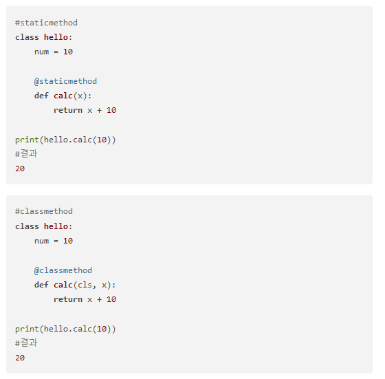

### Tips for python

- staticmethod / classmethod

    staticmethod와 classmethod는 둘 다 class의 instance를 만들지 않아도 바로 class 내부에 만들어진 method를 사용할 수 있다는 점이다. 

 

 

- staticmethod? classmethod?  
https://wikidocs.net/21054

- class? object? instance? 
https://kingnamji.tistory.com/6

